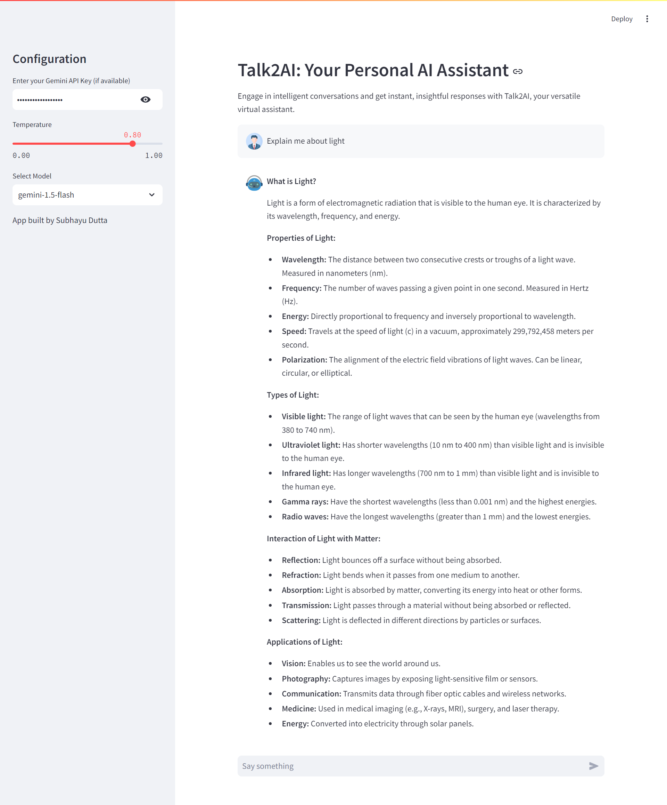

# Talk2AI: Your Personal AI Assistant

Engage in intelligent conversations and get instant, insightful responses with Talk2AI, your versatile virtual assistant.

Visit the live app: [Talk2AI](https://talk2csv.onrender.com/)

## Features

- Chat with an AI-powered virtual assistant.
- Supports multiple GEMINI models: gemini-1.5, gemini-1.5-pro, gemini-1.0-pro, and gemini-1.5-flash.
- Adjustable temperature setting to control response randomness.
- User-friendly interface built with Streamlit.

## Technologies Used:
- LangChain
- Streamlit
- Google Generative AI
- Faiss

## Installation:
1. Clone the repository: `git clone https://github.com/subhayudutta/Talk2Image.git`
2. Navigate to the project directory: `cd Talk2Image`
3. Install dependencies: `pip install -r requirements.txt`

## Usage:
1. Run the Streamlit app: `streamlit run app.py`
2. Access the app in your browser at `http://localhost:8501`

## Usage:
1. Open the app in your browser.
2. Enter your Gemini API key if you have one.
3. Adjust the temperature setting using the sidebar slider.
4. Select the desired GEMINI model from the dropdown menu.
5. Start chatting!

## Example:
Enter a message in the chat box and receive a response from the AI assistant based on the selected model and settings.

## Configure the following settings in the sidebar:
1. Gemini API Key: Enter your Gemini API key for AI model access.
2. Temperature: Adjust the temperature slider for response generation.
3. Model Selection: Choose the appropriate AI model for data analysis.

## Contribution:
Contributions are welcome! Feel free to open an issue or submit a pull request.

## License:
This project is licensed under the [GPL-3.0 license](LICENSE).
Feel free to customize the README according to your project's specifics!

